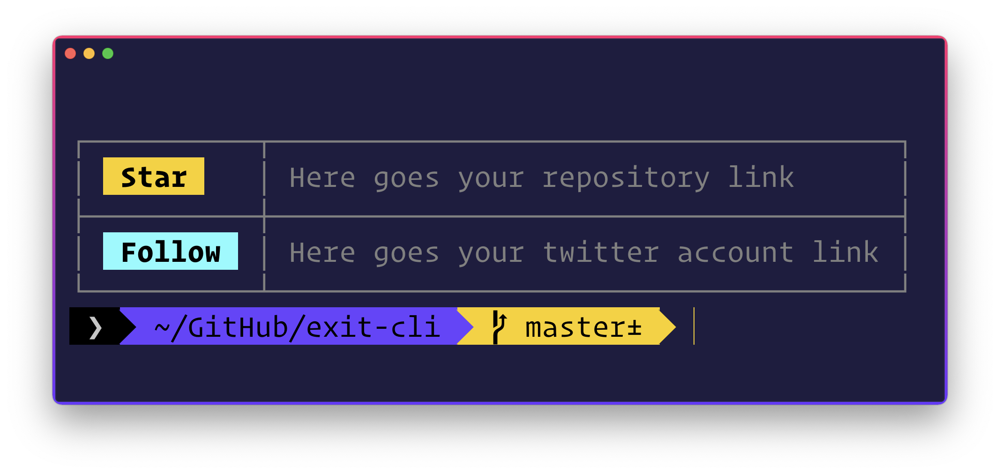

# ⚡️ exit-cli


>A nice way to exit your command-line tools.

## Features

- Adds a nice exit message in your CLI using your repo and twitter link.
- Notify users if a CLI update is available

<br>


## Install

```sh
# install the package
npm install exit-cli
```

<br>


## API

- github (required)
- twitter (required)
- pkgJSON (optional) *Add this if you want the package to notify for CLI updates*

<br>


## Usage

- Just display the exit message
```js
const end = require('exit-cli');

// without package.json file
await end({
	github: `https://github.com/msaaddev/exit-cli`,
	twitter: `https://twitter.com/msaaddev`
})

```

- Also notify the user if an update is available for the CLI

```js
const end = require('exit-cli');
const packageJSON = require('./package.json');

// with package.json file
await end({
	github: `https://github.com/msaaddev/exit-cli`,
	twitter: `https://twitter.com/msaaddev`,
	pkgJSON: packageJSON
})

```

## ⚡️ Other Projects

I have curated a [detailed list](https://github.com/msaaddev/open-source) of all the open-source projects I have authored. Do take out a moment and take a look.

## 🔑 License & Conduct

- MIT © [Saad Irfan](https://github.com/msaaddev)
- [Code of Conduct](https://github.com/msaaddev/exit-cli/blob/master/code-of-conduct.md)
